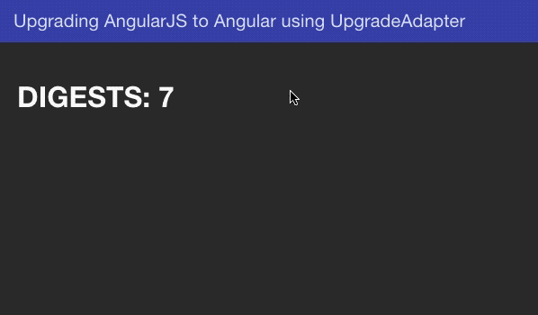

# Addendum 1: Angular $digest issues

If you upgrade a larger application you might notice some immediate performance issues. One of the biggest issues with the current state of the `UpgradeModule` is the way "*Angular uses Zone.js to create its own zone (NgZone), which monkey-patches all asynchronous events (browser DOM events, timeouts, AJAX/XHR). This is how change detection is able to automatically run after each asynchronous event. I.e., after each asynchronous event handler (function) finishes, Angular change detection will execute [source](https://stackoverflow.com/a/35469104/679716).*"

This is an issue actively being addressed and is discussed in [Jeff Cross's talk](https://drive.google.com/file/d/0Bw6GBXhPGkUGUWFLNFBlUkM5Tms/view) in the **Zones** section.  At the time of this writing there is not a video available for this talk, but if one becomes available I will link to it here.

Essentially, to write code that won't trigger digests in AngularJS you need to add native javascript event handlers. Many libraries will often do this in order to handle events in their own way, such as AngularMaterial. The problem is that when using the UpgradeModule these event handlers are "patched" to now trigger &#36;digests. This can become quite problematic for a library such as AngularMaterial which has event handlers for mouse movements: with a hybrid app that uses AngularJS AngularMaterial a digest will now be triggered [every time the mouse is moved](https://github.com/angular/material/issues/10636).

We can observe this behavior by using something like batarang or just adding some simple code to our main template and controller.

**main.component.html**

```

<div class="main-container">
    <h1>DIGESTS: <span id="digest-count">0</span></h1>
```

**main.component.js**

```
MainController.$inject = ['$scope'];

function MainController($scope) {
  var digestCount = 0;

  $scope.$watch(updateDigestCount);

  function updateDigestCount() {
    document.getElementById('digest-count').textContent = ++digestCount;
  }
}
```

Now on all our pages we will see the total number of digests ran since starting the application.

Alternatively, you could just log the digest counts to the console by pasting this in:

```
var count = 0;
function incrementAndUpdateCount() { console.log(++count); };
angular.element(document.body).injector().get('$rootScope').$watch(incrementAndUpdateCount);
```

**BEFORE**


One solution is to grab all the event handlers that you want to run outside of the Angular zone, deregister them, then re-register them outside the Angular zone.  We can do this in the run block of setting up our angularjs application.

**app.run.js**

```
(function() {
  'use strict';

  angular
    .module('angularSeed')
    .run(bindEventsToParentZone);

  bindEventsToParentZone.$inject = ['$window'];

  function bindEventsToParentZone($window) {
    // grab a copy of existing events in this zone
    var existingEventsObj = angular.copy(angular.element._data(angular.element(document)[0])['events']);
    // *NOTE* if using angular 1.5.x you might need this instead:
    // angular.element._data(angular.element(document)[0], 'events')
    // and the handlerFunction names are namespaced as event.handler.name

    angular.element(document).off();

    angular.forEach(existingEventsObj, function(eventsForEventName, eventName) {
      angular.forEach(eventsForEventName, function(event) {
        if (_isEventToRunoutsideZone(event)) {
          $window.Zone.current.parent.run(function() {
            angular.element(document).on(eventName, event);
          });
        }
        else {
          // bind all other events back to current zone (where they were)
          $window.Zone.current.run(function() {
            angular.element(document).on(eventName, event);
          });
        }
      });
    });
  }

  function _isEventToRunoutsideZone(event) {
    var handlerFunctionName = event.name;

    var handlerFunctionNamesToRunOutsideZone = [
      'gestureStart',
      'gestureMove',
      'gestureEnd',
      'gestureClearCache'
    ];

    return (
      handlerFunctionNamesToRunOutsideZone.indexOf(handlerFunctionName) !== -1
    );
  }
})();
```

Here the events we grab are the event handler function names from AngularMaterial. We take those and re-register them in the parent zone, and the rest we re-register them in the current zone (the angular zone).

**AFTER**



[See pull request which introduced this code](/../../../pull/10/files)
